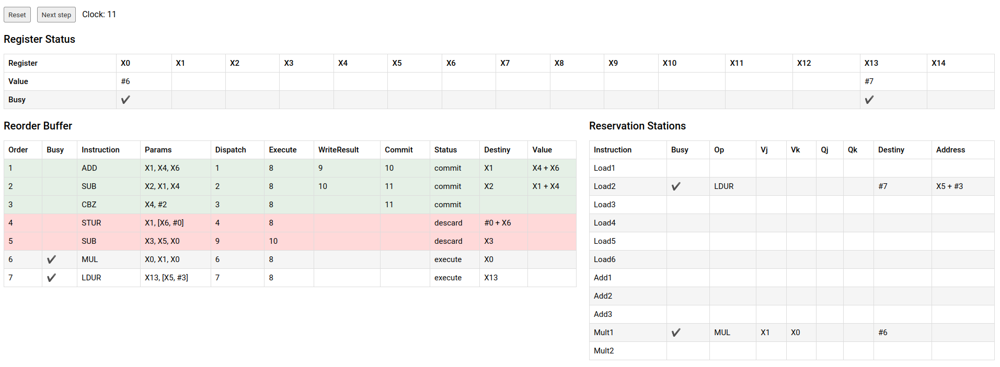

# Tomasulo Algorithm Simulator with Reorder Buffer

## 💻 Preview
<div align="center">
  
</div>

## 🛠 Tools

- [VueJs](https://vuejs.org/)
- [Vuex](https://vuex.vuejs.org/)

## 🚀 Installation
```bash
$ git clone https://github.com/Gabrielhsm20/tomasulo-simulator-rob.git
$ cd tomasulo-simulator-rob
$ npm install
$ npm run serve
```